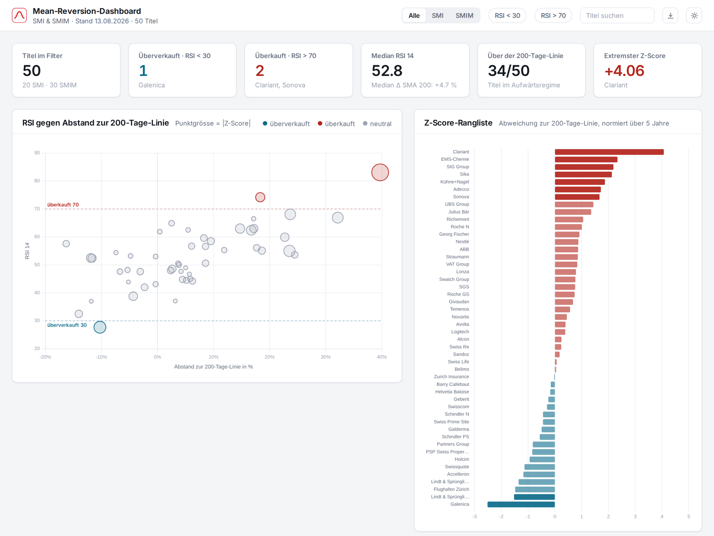

# Mean-Reversion-Dashboard SMI & SMIM

Statische Web-App mit Mean-Reversion-Kennzahlen für alle 50 Titel des **Swiss Market Index (SMI)** und des **SMI MID (SMIM)**.

**Live:** https://boettch1806.github.io/smi-mean-reversion/



## Kennzahlen

| Kennzahl | Definition |
| --- | --- |
| **RSI 14** | Relative Strength Index nach Wilder, exponentielle Glättung mit Alpha = 1/14, auf Tagesschlusskursen. Unter 30 gilt als überverkauft, über 70 als überkauft. |
| **Δ SMA 200** | Prozentualer Abstand des letzten Schlusskurses zum einfachen 200-Tage-Durchschnitt. |
| **Z-Score** | Logarithmische Abweichung `ln(Kurs) − ln(SMA200)`, standardisiert an Mittelwert und Standardabweichung derselben Grösse über die letzten fünf Jahre. Positiv = teurer als normal, negativ = billiger als normal. |
| **Volatilität** | Standardabweichung der täglichen Log-Renditen, annualisiert mit √252, für ein und für fünf Jahre. |
| **Ø Rückkehrdauer** | Mittlere Zahl an Handelstagen von dem Moment, in dem \|Z\| erstmals 1,0 überschreitet, bis die Abweichung ihren 5-Jahres-Mittelwert wieder durchkreuzt. |
| **Halbwertszeit** | `−ln 2 / ln φ` aus einer AR(1)-Schätzung der Abweichung, in Handelstagen. |
| **Episoden** | Anzahl der Ereignisse mit \|Z\| > 1 in den letzten fünf Jahren. |

## Funktionen

- Filter nach Index (SMI / SMIM), nach RSI-Zone (< 30 / > 70) und Freitextsuche
- Sortierbare Tabelle über alle zwölf Kennzahlen
- Streudiagramm RSI gegen Abstand zur 200-Tage-Linie, Punktgrösse nach \|Z-Score\|
- Z-Score-Rangliste aller Titel
- Detailkarten für die sechs extremsten Z-Scores mit 5-Jahres-Z-Verlauf
- Hell- und Dunkelmodus, folgt der Systemeinstellung
- Filterzustand in der URL, damit Ansichten teilbar sind
- CSV-Export der aktuellen Auswahl

## Datenstand

- Tagesschlusskurse in CHF, 04.01.2021 bis 13.08.2026
- Indexzusammensetzung per 13.08.2026. Die ordentliche Index-Anpassung von SIX vom Juli 2026 (Galderma und Sandoz in den SMI, Swisscom und Kühne+Nagel in den SMIM) wird erst am 21.09.2026 wirksam und ist nicht berücksichtigt.
- Amrize und Sunrise haben eine zu kurze Historie für einen 5-Jahres-Z-Score.
- Beim Roche-Genussschein (`ROG`) endet die Kursreihe des Datenanbieters am 13.04.2026; der Titel ist in der Tabelle als Datenlücke markiert. Für aktuelle Roche-Signale dient die Namenaktie (`RO`) im SMIM.

## Aufbau

```
index.html    Struktur und Layout
style.css     Design-Tokens, Hell-/Dunkelmodus, Tabellen- und Kartenstile
app.js        Filterlogik, Tabelle, Chart.js-Diagramme, URL-Zustand, CSV-Export
data.js       vorberechneter Datensatz: 50 Titel plus 5-Jahres-Z-Verläufe
```

Keine Build-Schritte, keine Abhängigkeiten ausser Chart.js über CDN. Lokal starten:

```bash
python3 -m http.server 8000
# http://localhost:8000
```

## Daten aktualisieren

`data.js` enthält `window.DATA = { rows: [...], series: {...} }`. `rows` trägt eine Zeile pro Titel mit den oben beschriebenen Feldern, `series` je Ticker die wöchentlich abgetasteten Reihen `d` (Datum), `p` (Kurs), `m` (SMA 200) und `z` (Z-Score). Wer die Kennzahlen neu berechnet, muss lediglich diese Datei ersetzen.

## Haftungsausschluss

Dies ist ein Analysewerkzeug, keine Anlageberatung und keine Anlageempfehlung. Die Kurse sind nicht um Splits oder Dividenden bereinigt. Mean-Reversion-Signale sind statistische Beobachtungen der Vergangenheit und sagen nichts über künftige Kursverläufe.
